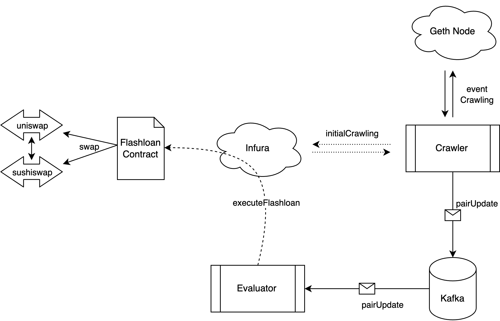

# Uniswap v2 Flashloan Arbitrage

This repository contains an end-to-end system for performing flashloan-based arbitrage on Uniswap v2 and Sushiswap. The project demonstrates how to:

- Continuously monitor on-chain events to detect potential arbitrage opportunities.
- Evaluate arbitrage opportunities between Uniswap v2 and Sushiswap.
- Execute profitable flashloan transactions on Uniswap v2 to capture arbitrage profits.

## Overview

Flashloans allow users to borrow assets without collateral, as long as the borrowed amount is returned within the same transaction. This project exploits that mechanism to perform arbitrage on Uniswap v2 and Sushiswap by taking advantage of price discrepancies across different liquidity pools of AMMs.

The project consists of:

- A crawler that listens for on-chain events (like pair updates) from a Geth node or Infura.
- A Kafka message bus for publishing and subscribing to updated pair data.
- An evaluator service that checks for profitable arbitrage opportunities.
- A smart contract that executes the flashloan-based swap.

When the evaluator finds an opportunity, it triggers the flashloan contract to borrow assets, swap them on the appropriate DEX, and repay the loan, capturing any profit.

## License

This project is licensed under the Apache License 2.0 License. See the [LICENSE](https://www.apache.org/licenses/LICENSE-2.0) file for more details.

